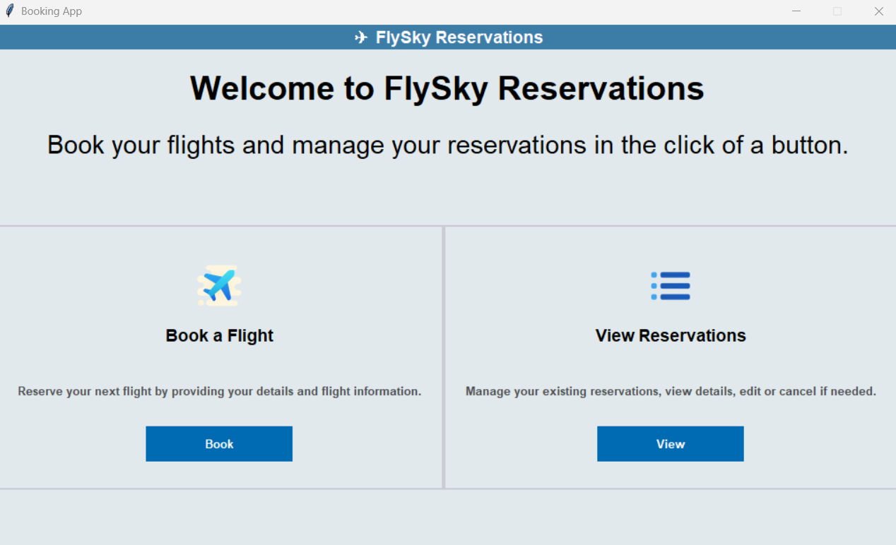
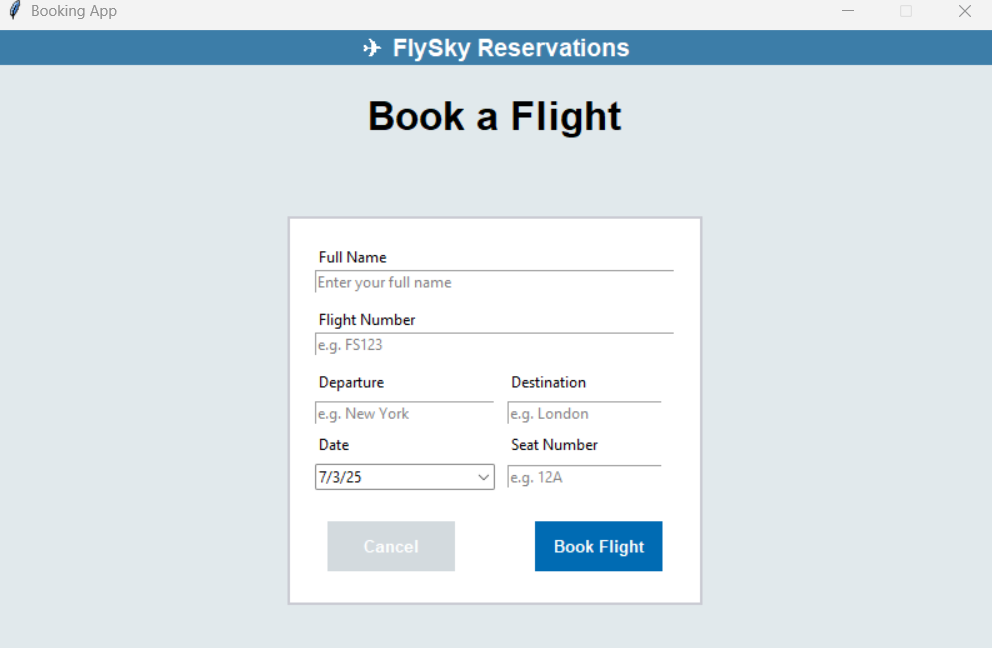
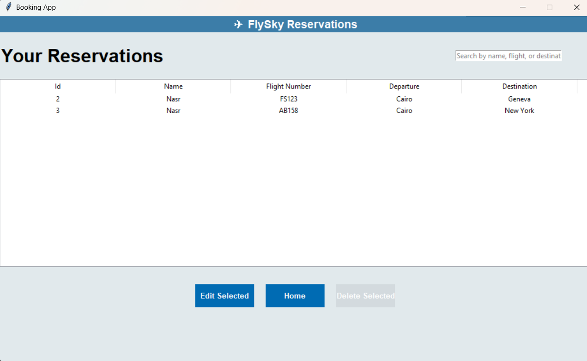
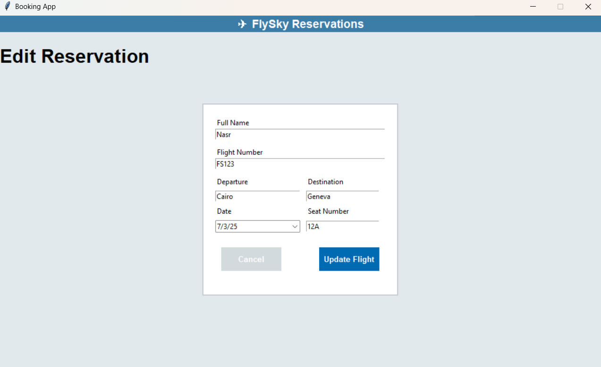

# ✈️ FlySky Reservations

**FlySky Reservations** is a modern, standalone desktop application built with Python, Tkinter, and SQLite. It allows users to book flights, view, edit, and manage reservations — all from a clean, user-friendly interface.

---

## 💡 What It Can Do

With FlySky Reservations, you can:

- 📋 **Book Flights** by entering traveler and flight details
- 🔍 **Search Reservations** live by name, flight number, or destination
- 📑 **View All Reservations** in a sortable, scrollable table
- ✏️ **Edit Existing Reservations** with one click
- 🗑️ **Delete Entries** with confirmation prompts
- 💾 **Save Data Locally** via a built-in SQLite database (no internet required)
- 💻 **Run as a Native Windows App** — with installer, icons, and uninstaller

---

## 🎯 Features

| Feature              | Description |
|----------------------|-------------|
| 🏠 **Home Dashboard**     | Choose to book or view reservations |
| 🛫 **Flight Booking**     | Easy-to-use form with placeholders and date picker |
| 📂 **Reservation Manager** | Search, sort, edit, delete |
| ✍️ **Edit Page**          | Pre-filled editable fields for selected reservation |
| 🗃 **SQLite Storage**     | Lightweight local database, auto-created on first run |
| 🌈 **Styled Interface**   | Icons, hover effects, bordered cards, consistent UI |
| 📦 **Installer**          | NSIS-built setup wizard with uninstaller and desktop shortcut |

---
***

## Technology Stack

- **Core Language**: Python
- **GUI Framework**: Tkinter
- **Database**: SQLite 3
- **Installer/Packaging**: NSIS (Nullsoft Scriptable Install System), PyInstaller
- **Additional Libraries**:
  - `tkcalendar`: For a user-friendly date picker widget.

***

## How to Use

1.  **Home Page**: When you launch the app, you'll see the home screen with two main options:
    - **Book a Flight**: Navigates to the booking form.
    - **View Reservations**: Takes you to the list of all current reservations.

2.  **Booking a Flight**:
    - Fill in all the fields in the form (Name, Flight Number, Departure, etc.).
    - Click **"Book Flight"** to save the reservation.

3.  **Viewing and Managing Reservations**:
    - The reservations list displays all bookings.
    - Use the **search bar** to filter results instantly.
    - To edit or delete a reservation, **first click to select a record** from the table.
    - Click **"Edit Selected"** to open the editing form with the data pre-filled.
    - Click **"Delete Selected"** to permanently remove the record (a confirmation dialog will appear).

***
## 📸 Screenshots

### 🏠 Home Page
Provides quick access to core actions: booking a flight or managing reservations.


---

### 🛫 Booking Page
User-friendly form with placeholders, validation, and a calendar-based date picker.


---

### 📋 Reservations Page
Sortable table with search and full CRUD actions (edit/delete), styled with alternating row colors.


---

### ✏️ Edit Reservation
Pre-filled form for updating existing reservations quickly.



## 📥 How to Install

### 🖥 For End Users

1. **Download `FlySkySetup.exe`** from [Releases](https://github.com/Mohammed-Nasr-137/Flight_Reservation_App/releases)
2. Run the installer
3. Launch the app via the **Desktop shortcut**

🧼 You can uninstall it anytime from **Control Panel > Add/Remove Programs**

---

## ⚙️ For Developers

### 1. 📦 Clone and Install

```bash
git clone https://github.com/yourusername/flysky-reservations.git
cd flysky-reservations
pip install -r requirements.txt
